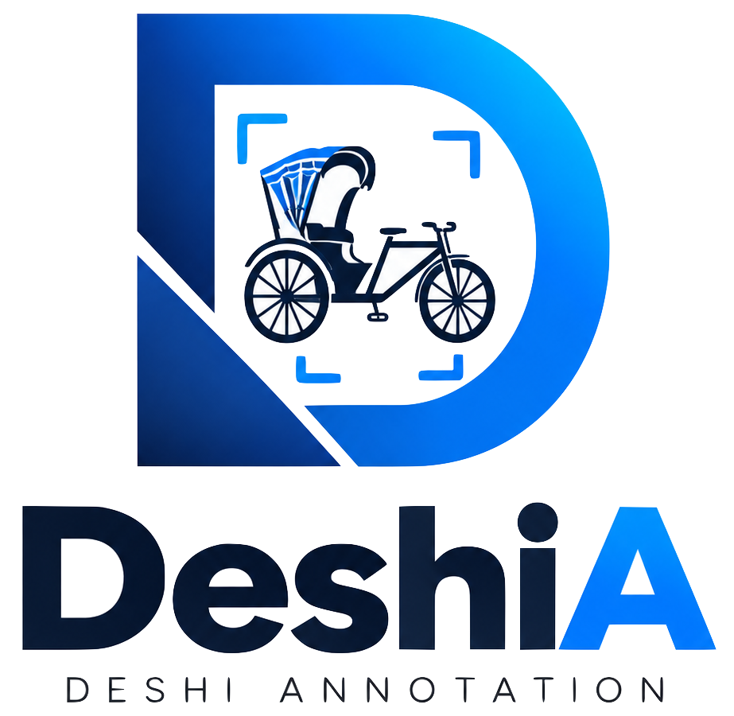

<div align="center">



# DeshiA — Deshi Annotation

**An extensible, schema-driven image annotation workstation for computer-vision research.**

Organize images · label hierarchically · draw bounding boxes · recover from crashes · export reproducible datasets.

[](LICENSE)
[](CHANGELOG.md)
[](https://tauri.app)
[](https://nextjs.org)
[](https://www.typescriptlang.org)
[](https://orm.drizzle.team)
[](CONTRIBUTING.md)

</div>

---

## Overview

**DeshiA** (Deshi Annotation) is an open-source **desktop** workstation for building structured computer-vision datasets. A Next.js UI drives a local Node backend (SQLite + Sharp) inside a Tauri v2 shell — everything runs offline on your machine, no cloud, no uploads.

- 🧩 **Schema-driven, not hardcoded** — the entire annotation UI is generated from an `AnnotationSchema`. The bundled Rickshaw / E-Rickshaw ontology is only the *first* dataset, never a limitation.
- 🎯 **Bounding boxes done right** — normalized `0..1` coordinates, deterministic per-component colors, and Pascal VOC XML export.
- 💾 **Never lose work** — autosaved drafts, an append-only event log, and crash recovery that resumes exact state.
- 🔒 **Safe by construction** — source images stay read-only; an image is marked `ANNOTATED` only after every output file is written and verified on disk.
- 🖥️ **A real desktop app** — native folder pickers and a packaged installer that runs without a dev server.

> **Status:** `v0.1.0`, active development. First target dataset: a Bangladeshi **Rickshaw / E-Rickshaw** set (~500 images).

## Contents

- [Features](#features) · [Architecture](#architecture) · [Tech stack](#tech-stack) · [Getting started](#getting-started) · [Scripts](#scripts)
- [Project structure](#project-structure) · [The annotation model](#the-annotation-model) · [Colors](#bounding-box--color-rules) · [Export](#dataset-export)
- [Building the desktop app](#building-the-desktop-app) · [Testing](#testing) · [Docs](#documentation) · [Roadmap](#roadmap) · [Contributing](#contributing) · [License](#license)

## Features

| Area | What you get |
| --- | --- |
| **Workspace** | Point DeshiA at a source-image folder and an output folder; it validates paths and scaffolds the full `DeshiA_Output/` tree up front. |
| **Scanning** | Recursive discovery with SHA-256 checksums, Sharp metadata, and duplicate / unsupported-format classification. |
| **Hierarchical labeling** | Dataset → Class → View → Component, all resolved from the active schema. Changing the class changes the available views and components. |
| **Bounding boxes** | Konva canvas with draw / move / resize, normalized storage, and validation (`0 ≤ xMin < xMax ≤ 1`). |
| **Distinct colors** | Deterministic, perceptually separated, color-blind-aware palette assigned by component key — no two different components in one image share a color. |
| **Autosave & recovery** | Drafts persist continuously; an append-only `annotation_events` log makes every session resumable to exact state after a crash. |
| **Export** | Pascal VOC XML + clean RAW / ANNOTATED image copies, written through a verified submission transaction. |
| **Progress** | Per-workspace dashboard: pending / in-progress / annotated / skipped counts backed by a stable `datasetIndex`. |

## Architecture

Strictly layered — dependencies point in one direction, and **no database or filesystem logic ever lives in a React component**.

```
UI  (Next.js App Router + React components)
      ↓
Application Services  (server actions / route handlers — orchestration)
      ↓
Domain Logic  (src/core: annotation engine, validation, exporter, recovery, scanner)
      ↓
Persistence  (src/db: Drizzle schema + repositories)
      ↓
Filesystem  (source images read-only · DeshiA_Output written)
```

**Runtime model.** The heavy lifting (Drizzle + `better-sqlite3`, filesystem scanning, Sharp, VOC export) runs in the **Next.js Node runtime**. Tauri stays a thin shell: it hosts the webview, provides native folder dialogs, and — in a packaged build — launches the bundled Node server. See [`docs/architecture.md`](docs/architecture.md).

## Tech stack

| Layer | Technology |
| --- | --- |
| Framework | [Next.js 14](https://nextjs.org) (App Router) · [React 18](https://react.dev) |
| Language | [TypeScript 5.6](https://www.typescriptlang.org) — **strict**, no `any`, no enums (`as const` unions) |
| UI | [Tailwind CSS](https://tailwindcss.com) · [shadcn/ui](https://ui.shadcn.com) (Radix) · [Lucide](https://lucide.dev) · [Geist](https://vercel.com/font) |
| State | [Zustand](https://zustand-demo.pmnd.rs) |
| Canvas | [Konva](https://konvajs.org) / [react-konva](https://konvajs.org/docs/react) |
| Database | [SQLite](https://www.sqlite.org) via [Drizzle ORM](https://orm.drizzle.team) + [better-sqlite3](https://github.com/WiseLibs/better-sqlite3) |
| Images | [Sharp](https://sharp.pixelplumbing.com) (metadata + copies) |
| Validation | [Zod](https://zod.dev) |
| Desktop | [Tauri v2](https://tauri.app) (Rust shell + Node sidecar) |
| Testing | [Vitest](https://vitest.dev) (unit) · [Playwright](https://playwright.dev) (e2e) |
| Tooling | [pnpm](https://pnpm.io) · ESLint · Prettier |

## Getting started

### Prerequisites

- **Node.js** ≥ 20.11 and **pnpm** 9 (`corepack enable`)
- **Rust** stable + the [Tauri v2 prerequisites](https://tauri.app/start/prerequisites/) — only needed to run or build the desktop shell

```bash
git clone https://github.com/0mehedihasan/deshia.git
cd deshia
pnpm install
pnpm db:generate      # generate the SQLite migrations from the Drizzle schema
```

### Run in the browser (fastest inner loop)

```bash
pnpm dev              # http://localhost:3000
```

> In plain browser mode the native folder picker is inert by design — type paths directly, or run the desktop shell below for real dialogs.

### Run as the desktop app

```bash
pnpm tauri:dev        # native window + folder dialogs, hot-reloads the UI
```

## Scripts

| Command | Description |
| --- | --- |
| `pnpm dev` | Next.js dev server (browser) |
| `pnpm tauri:dev` | Desktop shell in dev mode (native dialogs) |
| `pnpm build` | Production Next.js build (`output: 'standalone'`) |
| `pnpm tauri:build` | Package the desktop app (`.dmg` / installer) |
| `pnpm typecheck` | `tsc --noEmit` — strict type check |
| `pnpm lint` | ESLint (`next lint`) |
| `pnpm format` / `format:check` | Prettier write / check |
| `pnpm test` / `test:watch` | Vitest unit tests |
| `pnpm test:e2e` | Playwright end-to-end tests |
| `pnpm db:generate` | Generate Drizzle SQL migrations |
| `pnpm db:migrate` | Apply migrations |

## Project structure

```
deshia/
├─ src/
│  ├─ app/            Next.js routes, layouts, server actions, route handlers
│  ├─ components/     Reusable UI (incl. components/ui shadcn primitives)
│  ├─ features/       Screen modules: workspace · dataset · annotation · dashboard · export · settings
│  ├─ core/           Domain logic (framework-free)
│  │  ├─ scanner/       recursive scan, checksum, Sharp metadata, classification
│  │  ├─ filesystem/    path validation, filename sanitization, output tree
│  │  ├─ annotation/    schema-driven engine, color palette, bbox math, validation
│  │  ├─ recovery/      draft detection + resume
│  │  ├─ exporter/      Pascal VOC XML, filename generation, submission transaction
│  │  └─ validation/    shared validators
│  ├─ db/             Drizzle schema, repositories, migrations (server-only)
│  ├─ schemas/        AnnotationSchema types, zod validation, built-in Rickshaw schema
│  ├─ stores/         Zustand client stores (working state, autosave status)
│  └─ lib/ hooks/ types/ utils/
├─ src-tauri/         Rust desktop shell (webview, dialogs, Node-sidecar packaging)
├─ docs/              Architecture & subsystem documentation
├─ e2e/               Playwright specs
└─ scripts/           build-desktop.mjs (packaging pipeline)
```

## The annotation model

Everything the annotator sees is derived from a schema:

```
Dataset → Class → View / Subclass → Component → Visibility rule → Bounding-box rule
```

Visibility states are schema-configurable: **`VISIBLE`** (box required when the schema says so), **`OCCLUDED`**, and **`NOT_VISIBLE`** (no box required). Annotate only *major* structural / mechanical / electrical / class-discriminative components — not decorative parts, screws, or minor hardware.

### Built-in Rickshaw / E-Rickshaw schema

The first dataset ships in [`src/schemas`](src/schemas). Classes: **Rickshaw**, **E-Rickshaw**. Views: **Front**, **Side**, **Back**.

| Class + View | Required | Main components | Domain rule |
| --- | --- | --- | --- |
| Rickshaw + Front | Rickshaw Body, Steering Head | — | |
| Rickshaw + Side | Rickshaw Body | Pedal / Crank Assembly, **Chain** | Chain is a **separate** box — never merged into Pedal/Crank |
| Rickshaw + Back | Rickshaw Body | Rear Drive Assembly | The round rear part is **not** a "Motor" |
| E-Rickshaw + Front | E-Rickshaw Body, Steering Head | Electric Control / Circuit | |
| E-Rickshaw + Side | E-Rickshaw Body | Electric Drive Area | Pedal is **optional** — not required when absent |
| E-Rickshaw + Back | E-Rickshaw Body, Electric Motor | — | |

> Want a different dataset? Author a new `AnnotationSchema` — the engine and UI adapt with **zero** code changes. See [`docs/annotation-schema.md`](docs/annotation-schema.md).

## Bounding-box & color rules

- Boxes are stored **normalized** (`0..1`) and validated (`0 ≤ xMin < xMax ≤ 1`, `0 ≤ yMin < yMax ≤ 1`); pixel conversion happens only at the canvas and exporter edges.
- Colors are assigned **deterministically by component key** (not render order), so they're stable within a session and distinct components never collide — extra components get the next perceptually distinct hue via golden-angle rotation.
- Border and label text share the component color; label background is a darker translucent variant; the interior fill stays ~8–12% opacity so the image is never obscured.
- Meaning is never encoded with red/green alone (color-blind aware). See [`src/core/annotation/palette.ts`](src/core/annotation/palette.ts).

## Dataset export

The output tree keeps clean data and visualizations strictly separate:

```
DeshiA_Output/
├─ RAW/<class>/<view>/                       original images, copied (never modified)
├─ ANNOTATED/<class>/<view>/
│  ├─ images/                                clean images (NO boxes drawn)
│  └─ annotations/                           Pascal VOC XML
└─ VISUALIZATIONS/                           box-rendered previews only
```

- Filenames derive from the persistent `datasetIndex` (never a directory file count): `raw_<class>_<view>_<NNN>.jpg`, `annotated_<class>_<view>_<NNN>.(jpg|xml)`. All names are sanitized; source filenames are never trusted as identifiers.
- **Submission transaction (order matters):** validate → persist annotation → generate XML → copy RAW image → copy clean annotated image → **verify files exist & non-empty** → update DB → mark `ANNOTATED` → load next `PENDING`. Any failure preserves the draft, surfaces an error, and allows retry. See [`docs/export-format.md`](docs/export-format.md).

> Initial export format is **Pascal VOC XML**. COCO and YOLO are surfaced in the UI but not yet implemented.

## Building the desktop app

`pnpm tauri:build` runs the full packaging pipeline (`scripts/build-desktop.mjs`):

1. `next build` → a standalone Node server.
2. Stage the server + Drizzle migrations and pack them into a single `app.tar` resource; bundle a Node runtime as an `externalBin`.
3. At launch the Rust shell extracts `app.tar` to a writable per-user dir, spawns `node server.js` on a free loopback port, and points the webview at it — so the packaged app needs **no local dev server**.

<details>
<summary>Notes for macOS builds</summary>

- Native addons (`better-sqlite3`, `sharp`) and the bundled Node binary can't be cross-compiled — build on the target OS.
- The `.dmg` is **unsigned**: on first open, right-click the app → **Open** to get past Gatekeeper.
- Startup progress and any failure are written to `deshia-launch.log` in the app-data directory.

</details>

## Testing

```bash
pnpm typecheck        # strict TypeScript
pnpm lint             # ESLint
pnpm test             # Vitest unit tests
pnpm test:e2e         # Playwright: workspace → scan → annotate → save → resume → submit → verify
```

Unit tests cover the pure logic: scanning, checksums, schema & annotation validation, bbox normalization, color assignment, filename generation, VOC XML, export, and recovery.

## Documentation

| Doc | Topic |
| --- | --- |
| [architecture.md](docs/architecture.md) | Layers, runtime model, dev vs. packaged |
| [annotation-schema.md](docs/annotation-schema.md) | Authoring a schema for a new dataset |
| [dataset-format.md](docs/dataset-format.md) | Input expectations & classification |
| [export-format.md](docs/export-format.md) | Pascal VOC output & submission transaction |
| [recovery.md](docs/recovery.md) | Draft detection and crash recovery |
| [development.md](docs/development.md) | Local setup & workflow |
| [claude-context.md](docs/claude-context.md) | Context for AI coding agents |

## Roadmap

- [x] Schema-driven annotation engine + built-in Rickshaw / E-Rickshaw schema
- [x] Autosave, append-only event log, and crash recovery
- [x] Pascal VOC export with a verified submission transaction
- [x] Packaged desktop app (Tauri v2 + Node sidecar)
- [ ] COCO and YOLO export formats
- [ ] Schema editor UI (author datasets without code)
- [ ] Keyboard-first annotation flow & shortcuts
- [ ] Multi-annotator review / agreement tooling

See [CHANGELOG.md](CHANGELOG.md) for detailed release notes.

## Contributing

Contributions are welcome. Please read [CONTRIBUTING.md](CONTRIBUTING.md) and [AGENTS.md](AGENTS.md) (guidance for AI coding agents) before opening a PR. The essentials:

- Keep the dataset ontology in **schemas**, never in the core engine.
- Never silently lose annotation data; never mark `ANNOTATED` before files are verified.
- No DB or filesystem logic inside React components.
- Run `pnpm typecheck && pnpm lint && pnpm test` before submitting.

## Security

Source images are treated as read-only, imported schemas are Zod-validated, and every filesystem path is checked against traversal. Found a vulnerability? See [SECURITY.md](SECURITY.md) for responsible disclosure.

## License

Licensed under the [Apache License 2.0](LICENSE) © Md. Mehedi Hasan.

## Author

**Md. Mehedi Hasan** — Researcher / AI Engineer
Advanced Machine Intelligence Research Lab (AMIR Lab), Dept. of CSE
Bangladesh University of Business and Technology (BUBT), Dhaka
GitHub: [@0mehedihasan](https://github.com/0mehedihasan)

## Citation

If DeshiA supports your research, please cite it:

```bibtex
@software{hasan_deshia_2026,
  author  = {Hasan, Md. Mehedi},
  title   = {DeshiA: A Schema-Driven Image Annotation Workstation for Computer Vision Research},
  year    = {2026},
  url      = {https://github.com/0mehedihasan/deshia},
  version = {0.1.0}
}
```

<div align="center">
<sub>Built for reproducible computer-vision datasets · Correctness → data safety → usability → recovery.</sub>
</div>
